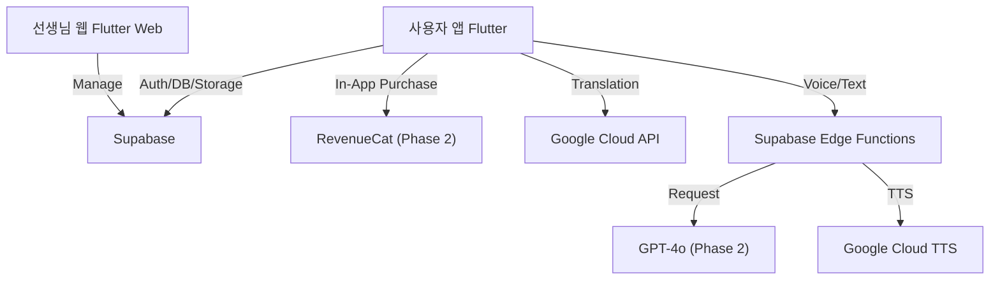

# Talkie SaaS Evolution Roadmap

현재의 독립형 앱(Standalone App)에서 **구독형 서비스(SaaS)**로 발전하기 위한 4가지 핵심 전략을 제안합니다.

---

## 📊 현재 앱 상태 (v1.8.16 기준, 2026-03-07)

| 항목 | 내용 |
|---|---|
| **배포 플랫폼** | Google Play Store (비공개 테스트 → 공개 출시 준비 중) |
| **지원 언어** | 80개국어 (한국어, 영어, 일본어, 스페인어 등) |
| **백엔드** | Supabase (Auth, PostgreSQL DB, Storage) |
| **Target SDK** | Android 15 (API 35), compileSdk 36 |
| **앱 버전** | v1.8.16+50 |
| **주요 구현 완료 기능** | Mode 1~4 전체, AI 페르소나 채팅, 온라인 자료실, 실시간 스마트 검색, TTS 80개 언어 |

---

## 1. AI 튜터 & 롤플레잉 (Premium B2C)
단순한 발음 체크를 넘어, 실제 상황처럼 대화하는 LLM(거대언어모델) 기반 기능입니다.
*   **현재 문제:** 정해진 문장만 읽는 연습은 실제 회화 적응력이 떨어짐.
*   **현재 상태 (구현 완료 ✅):** **"AI 페르소나 채팅 & 2개 국어 및 TTS 지원"**
    *   사용자가 '교사', '가이드', '친구' 등 페르소나를 선택하여 대화.
    *   AI 응답 및 사용자 메시지 2개 국어 표시 및 TTS 발음 듣기 지원.
    *   AI 응답 자동 번역 및 원하는 문장 즉시 학습 목록(Mode 2) 저장.
    *   JSON 파일을 통해 대화 데이터셋 및 과거 채팅 내역을 일괄 복원/가져오기 가능.
    *   채팅 다크 테마 UI 적용 및 실시간 스마트 검색 지원.
*   **다음 단계 (SaaS):** 고급 교정 & 무제한 대화 유료화 / 발음 정확도 점수 리포트.
*   **수익 모델:** 기본 채팅 무료 / 고급 교정 및 무제한 대화는 월 구독 ($9.99/월).

---

## 2. 콘텐츠 마켓플레이스 (Creator Economy)
현재의 JSON 파일 기능을 클라우드 플랫폼으로 확장합니다.
*   **현재 문제:** 좋은 학습 자료(JSON)를 구하기 어렵고, 만들기 귀찮음.
*   **현재 상태 (부분 구현 ✅):**
    *   Supabase 연동 온라인 자료실(Online Library): 클라우드에서 단어/문장 세트 공유 가능.
    *   JSON Import/Export: 사용자 간 학습 자료 공유의 기반 인프라 완성.
    *   80개국어 UI 지원으로 글로벌 콘텐츠 배포 기반 확보.
*   **다음 단계 (SaaS):** **"Talkie Store"**
    *   유명 강사나 일반 사용자가 자신만의 '단어장/문장 세트'를 유료로 등록.
    *   큐레이션: "영화 쉐도잉 세트", "토익 빈출 800" 등 고퀄리티 자료 유료 판매.
*   **수익 모델:** 프리미엄 자료 판매 수수료 or 구독자에게 무제한 다운로드 제공.

---

## 3. 학습 관리 시스템 (LMS) - 교육용 B2B
학교, 학원, 스터디 그룹을 위한 관리 도구입니다.
*   **현재 문제:** 선생님이 학생들의 연습 여부를 확인할 수 없음.
*   **현재 상태 (기반 인프라 완성 ✅):**
    *   Supabase Auth: 계정 기반 사용자 관리 가능.
    *   Mode 2, 3 학습 데이터 로컬 SQLite 저장 → 클라우드 연동으로 확장 가능.
*   **다음 단계 (SaaS):** **"Talkie Class"**
    *   선생님용 웹 대시보드: 학생들에게 이번 주 학습 세트를 원격 배포.
    *   리포트: 학생의 발음 점수, 학습 시간이 선생님에게 자동 전송.
*   **수익 모델:** 학생 1인당 월 과금 (학교/학원 대상 영업).

---

## 4. 실시간 단어 배틀 (Multiplayer)
혼자 하는 게임을 실시간 경쟁으로 확장하여 리텐션(재접속률)을 높입니다.
*   **현재 문제:** Mode 4 게임이 혼자 하기 심심할 수 있음.
*   **현재 상태:** Mode 4 단어 비 게임 싱글플레이어 구현 완료.
*   **다음 단계 (SaaS):** **"Word Rain Battle"**
    *   비슷한 레벨의 사용자와 1:1 매칭.
    *   같은 단어가 떨어지고, 누가 더 빨리 정확하게 말해서 없애는지 대결.
    *   승리 시 포인트 획득 → 앱 내 아바타 꾸미기 등 보상.
*   **수익 모델:** 부분 유료화 (게임 아이템), 광고 제거.

---

## 추천 단계 (Phasing)

| 단계 | 목표 | 상태 |
|---|---|---|
| **Phase 1** (User Base) | Supabase 연동, 80개국어, 온라인 자료실 | ✅ 완료 |
| **Phase 1.5** (Engagement) | AI 페르소나 채팅, TTS 80개 언어, 실시간 검색 | ✅ 완료 |
| **Phase 2** (Revenue) | RevenueCat 인앱 결제 연동, 프리미엄 구독 모델 도입 | 🔜 다음 목표 |
| **Phase 2.5** (Store) | Talkie Store (콘텐츠 마켓플레이스) 오픈 | 📋 계획 중 |
| **Phase 3** (Scale) | B2B (Talkie Class) 진출 | 📋 계획 중 |

---

## 5. 추천 기술 스택 (Tech Stack Strategy)
1인 개발 또는 소규모 팀이 효율적으로 확장하기 위한 **"가성비 & 생산성"** 중심의 스택입니다.

### A. 백엔드 (Backend as a Service)
*   **Supabase** ✅ (현재 사용 중)
    *   **DB:** PostgreSQL — 사용자, 학습 기록, 채팅 내역 관리.
    *   **Auth:** 소셜 로그인(Google, Kakao) 및 이메일 인증 통합.
    *   **Storage:** 온라인 자료실 파일 저장.
    *   **Edge Functions:** AI API 호출 등 서버 로직 처리.
    *   **Realtime:** 워드 배틀(멀티플레이) 구현 시 필수.

### B. AI & LLM
*   **Google Cloud Translation API** ✅ (현재 사용 중) — 80개국어 번역.
*   **OpenAI API (GPT-4o-mini):** 회화 롤플레잉 고도화 시 도입 예정.

### C. 결제 (Payments)
*   **RevenueCat** 📋 (Phase 2 도입 예정)
    *   인앱 결제(구글/애플) 구현의 복잡성을 제거. 구독 모델 관리에 필수.

### D. 웹 대시보드 (Talkie Class)
*   **Flutter Web:** 기존 앱 코드를 90% 재사용하여 선생님용 웹사이트를 빠르게 구축.

### E. 아키텍처 다이어그램 (Flow)

---
*Last Updated: 2026-03-07 (v1.8.16 기준 현재 상태 업데이트)*
