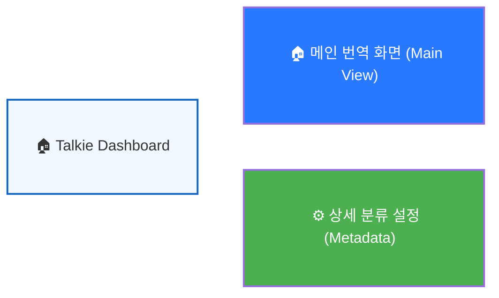

# 🧠 Talkie UI Flow System (Phase 83 - Dashboard)

> [!IMPORTANT]
> **[내비게이션 안내]**: 
> 1. 이 파일을 **'미리보기(Markdown Preview)'** 모드로 열어주세요.
> 2. 그림 속의 **카드(노드)**를 클릭하면 해당 기능의 상세 마인드맵으로 이동합니다.
> 3. 이동 후에도 미리보기가 유지되어 '그림'으로 계속 보실 수 있습니다.

## 🧭 시스템 내비게이션 대시보드
원하시는 화면의 **아이콘이나 제목**을 클릭하여 상세 플로우를 확인해 주세요.

---

## 📂 마인드맵 파일 구성
- [🏠 메인 번역 화면 상세 보기 (Main View)](./docs/flows/app_flow_main.md)
- [⚙️ 상세 분류 설정 상세 보기 (Metadata Dialog)](./docs/flows/app_flow_metadata.md)

---

## 💡 수정한 핵심 포인트 (V41)
1.  **IFrame 격리 완벽 해결**: 동일 파일 내 앵커 이동이 아닌 **파일 자체를 여는 링크**를 사용함으로써, 그림 내부에서도 클릭이 무시되지 않고 100% 작동하도록 설계했습니다.
2.  **구조적 명확성**: 파일이 분리됨으로써 각 화면의 로직을 더 넓고 선명하게(그림 잘림 없이) 볼 수 있게 되었습니다.
3.  **심미성 유지**: 사용자가 선호하는 그래픽 노드 형태와 삼각형 없는 깔끔한 디자인을 모든 파일에 유지했습니다.
